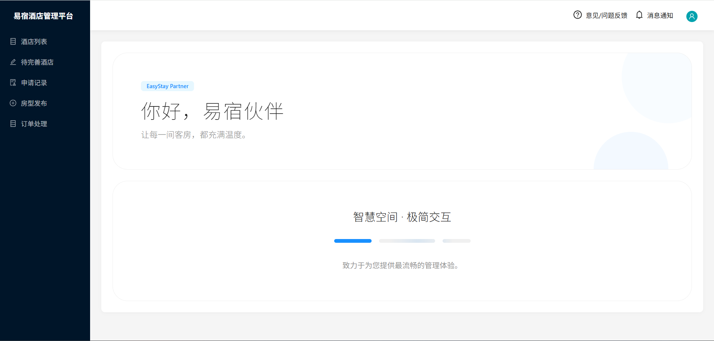
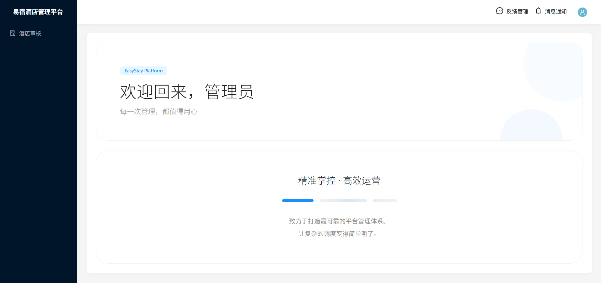

<p align="center">
  
</p>

<h1 align="center">🏨 易宿酒店预订平台</h1>

<p align="center">
  <strong>EasyStay Admin</strong> — 为商户与管理员打造的酒店资产与审核管理后台
</p>

<p align="center">
  <a href="#-功能特性">功能</a> •
  <a href="#-技术栈">技术栈</a> •
  <a href="#-快速开始">快速开始</a> •
  <a href="#-项目结构">项目结构</a> •
  <a href="#-接口一览">接口</a>
</p>

<p align="center">
  
  
  
  
  
  
</p>

---

## 功能特性

### 👤 商户端

| 模块           | 说明                                     |
| -------------- | ---------------------------------------- |
| **酒店列表**   | 查看名下酒店，支持筛选、搜索、上下线操作 |
| **房型发布**   | 新建/编辑酒店，支持批量导入房型（Excel） |
| **待完善酒店** | 管理草稿、被拒酒店，支持编辑、删除、恢复 |
| **申请记录**   | 查看审核进度与历史记录                   |
| **意见反馈**   | 向平台提交问题或建议                     |
| **消息通知**   | 接收审核结果、反馈回复、酒店状态变更     |

### 🔐 管理员端

| 模块         | 说明                                                          |
| ------------ | ------------------------------------------------------------- |
| **酒店审核** | 待审核 / 已发布 / 已拒绝 / 已下线，支持通过、驳回、下线、恢复 |
| **反馈管理** | 查看并回复商户反馈                                            |
| **消息通知** | 待审核酒店、新反馈提醒                                        |

### 消息与数据流

```
商户提交反馈 ──────► 通知所有管理员
管理员回复反馈 ───► 通知对应商户
酒店待审核 ───────► 通知所有管理员
审核通过/驳回 ────► 通知商户
酒店下线 ─────────► 通知商户
```

---

## 技术栈

| 层级       | 技术                                                                     |
| ---------- | ------------------------------------------------------------------------ |
| **前端**   | React 18、TypeScript、Vite 5、Ant Design 5、React Router、Zustand、Axios |
| **后端**   | Node.js、Express 5、TypeScript                                           |
| **数据库** | MongoDB、Mongoose                                                        |
| **认证**   | JWT                                                                      |
| **工具**   | ESLint、Husky                                                            |

---

## 快速开始

### 环境要求

- **Node.js** >= 18（前端构建仍依赖它）
- **MongoDB** 本地或 [MongoDB Atlas](https://cloud.mongodb.com)
- **pnpm**（推荐）或 npm
- **Bun**（可选，用于服务端直接运行）

### 1. 克隆项目

```bash
git clone https://github.com/yangling-happy/easyStay-admin.git
cd easyStay-admin
```

### 2. 安装依赖

```bash
# 在根目录安装所有依赖
pnpm install
```

### 3. 配置环境变量

在 `packages/server` 目录下新建 `.env`：

```env
# 数据库（本地或 Atlas）
MONGODB_URI=mongodb://127.0.0.1:27017/easyStay

# JWT 密钥（生产环境请更换）
JWT_SECRET=your-super-secret-key

# 端口（可选，默认 3000）
PORT=3000
```

### 4. 启动项目

**开发模式（需两个终端）：**

```bash
# 终端 1：启动后端
pnpm dev:server

# 终端 2：启动前端
pnpm dev:client
```

**使用 Bun 启动后端：**

```bash
# 方式 1：直接运行服务端源文件
cd packages/server
bun --watch src/index.ts

# 方式 2：通过 package.json 脚本
pnpm --filter server run dev:bun
```

**生产构建：**

```bash
# 构建所有
pnpm build

# 单独构建前端
pnpm build:client

# 单独构建后端
pnpm build:server

# 启动后端生产服务
pnpm --filter server start

# 使用 Bun 启动已构建的后端
pnpm --filter server run start:bun
```

- 前端：<http://localhost:5173>
- 后端：<http://localhost:3000>
- 健康检查：<http://localhost:3000/health>（返回 `{"status":"ok"}` 表示成功）

---

## 项目结构

```
easyStay-admin/
├── packages/                 # Monorepo 包目录
│   ├── client/               # 前端源码
│   │   ├── src/              # 前端源代码
│   │   │   ├── api/          # API 封装、请求配置
│   │   │   ├── components/   # 公共组件
│   │   │   ├── layouts/      # 布局（Sidebar、Navbar、Notice、Feedback）
│   │   │   ├── pages/        # 页面
│   │   │   │   ├── HotelAudit/       # 酒店审核（管理员）
│   │   │   │   ├── HotelList/        # 酒店列表（商户）
│   │   │   │   ├── HotelEdit/        # 酒店编辑、房型发布
│   │   │   │   ├── IncompleteHotels/ # 待完善酒店
│   │   │   │   ├── Login/            # 登录
│   │   │   │   ├── Register/         # 注册
│   │   │   │   └── ...
│   │   │   ├── store/        # 状态管理（Zustand）
│   │   │   ├── types/        # 类型定义
│   │   │   └── utils/        # 工具函数
│   │   └── package.json      # 前端包配置
│   └── server/               # 后端源码
│       ├── src/
│       │   ├── models/       # Mongoose 模型
│       │   ├── routes/       # 路由
│       │   ├── middleware/   # 中间件（认证等）
│       │   └── utils/        # 工具
│       ├── public/uploads/   # 上传文件
│       └── package.json      # 后端包配置
├── package.json              # 根目录配置
├── pnpm-workspace.yaml       # Workspace 配置
└── README.md
```

---

## 架构设计

本项目采用 B 端分层架构，实现 UI 表现层与业务数据层的解耦：

| 目录       | 职责                                   |
| ---------- | -------------------------------------- |
| `layouts/` | 全局布局（侧边栏、顶部栏、响应式容器） |
| `pages/`   | 按业务模块划分的页面                   |
| `api/`     | 服务层抽象，统一封装 CRUD 与请求逻辑   |
| `store/`   | 集中式状态管理，处理跨页面数据联动     |
| `types/`   | 业务实体类型定义，作为全链路数据契约   |

---

## 接口一览

| 模块 | 方法  | 路径                           | 说明         |
| ---- | ----- | ------------------------------ | ------------ |
| 认证 | POST  | `/api/auth/login`              | 登录         |
| 认证 | POST  | `/api/auth/register`           | 注册         |
| 酒店 | GET   | `/api/admin/hotels/pending`    | 待审核列表   |
| 酒店 | GET   | `/api/admin/hotels/published`  | 已发布列表   |
| 酒店 | POST  | `/api/admin/hotels/:id/audit`  | 提交审核     |
| 酒店 | PATCH | `/api/admin/hotels/:id/toggle` | 上下线切换   |
| 酒店 | GET   | `/api/hotels/records`          | 商户酒店列表 |
| 反馈 | POST  | `/api/feedback`                | 提交反馈     |
| 反馈 | PATCH | `/api/feedback/:id/reply`      | 回复反馈     |
| 通知 | GET   | `/api/notification`            | 获取通知列表 |

---

## 预览

<p align="center">
  <strong>商户端工作台</strong>
</p>
<p align="center">
  
</p>

<p align="center">
  <strong>管理员端工作台</strong>
</p>
<p align="center">
  
</p>

---

## License

MIT
